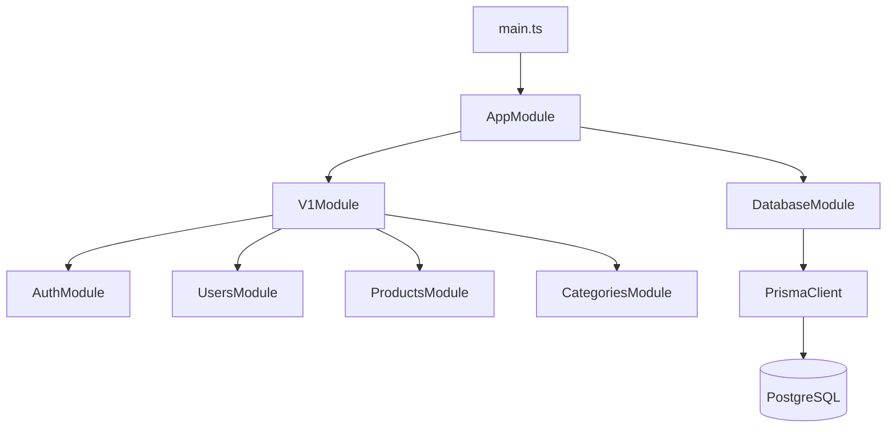

# Backend Documentation

## Backend Architecture

Backend menggunakan NestJS dengan struktur modular:

```txt
main.ts
  ↓
AppModule
  ↓
DatabaseModule
V1Module
  ↓
AuthModule
UsersModule
ProductsModule
CategoriesModule
```



## Backend Current Status

| Module     | Controller            | Service            | Status             | Catatan                                |
| ---------- | --------------------- | ------------------ | ------------------ | -------------------------------------- |
| App        | Ada GET `/`           | Ada getHello       | Starter            | Masih Hello World                      |
| Auth       | Ada controller kosong | Ada service kosong | Belum implementasi | Perlu register, login, refresh, logout |
| Users      | Ada controller kosong | Ada service kosong | Belum implementasi | Perlu CRUD user dan profile            |
| Products   | Ada controller kosong | Ada service kosong | Belum implementasi | Perlu CRUD product                     |
| Categories | Ada controller kosong | Ada service kosong | Belum implementasi | Perlu CRUD category                    |

## Endpoint Aktual

| Method | Endpoint | Fungsi                       | Status  |
| ------ | -------- | ---------------------------- | ------- |
| GET    | `/`      | Mengembalikan `Hello World!` | Starter |

## Rekomendasi Backend Layering

Rekomendasi struktur backend yang rapi untuk diimplementasikan:

```txt
api/src/v1/auth/
├── dto/
│   ├── login.dto.ts
│   ├── register.dto.ts
│   └── refresh-token.dto.ts
├── guards/
│   └── jwt-auth.guard.ts
├── strategies/
│   └── jwt.strategy.ts
├── auth.controller.ts
├── auth.service.ts
└── auth.module.ts

api/src/v1/users/
├── dto/
│   ├── update-profile.dto.ts
│   └── update-role.dto.ts
├── users.controller.ts
├── users.service.ts
└── users.module.ts

api/src/v1/categories/
├── dto/
│   ├── create-category.dto.ts
│   └── update-category.dto.ts
├── categories.controller.ts
├── categories.service.ts
└── categories.module.ts

api/src/v1/products/
├── dto/
│   ├── create-product.dto.ts
│   └── update-product.dto.ts
├── products.controller.ts
├── products.service.ts
└── products.module.ts
```

Prinsip:

* Controller hanya menerima request dan mengembalikan response.
* Service berisi business logic.
* DatabaseService/Prisma dipakai di service.
* DTO dipakai untuk validasi request.
* Guard dipakai untuk protected endpoint.
* Response format dibuat konsisten.
* Error handling dibuat global.