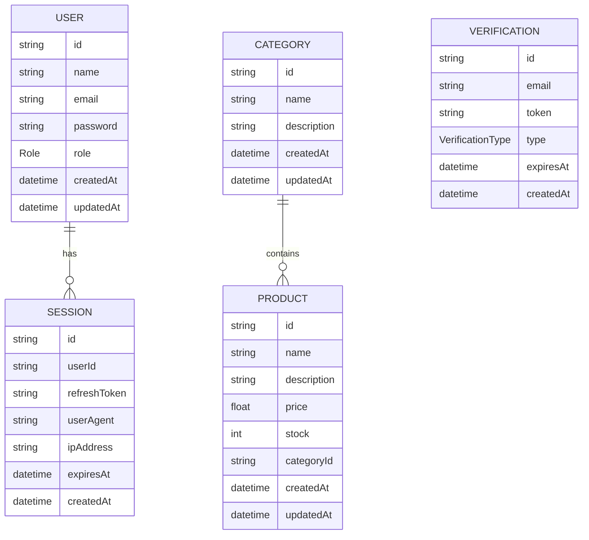

# Database Documentation

## Model User

Fungsi:
Menyimpan data user aplikasi.

Field penting:
- `id`: UUID primary key.
- `name`: nama user.
- `email`: email unik.
- `password`: password user.
- `role`: role user, default USER.
- `createdAt`: waktu dibuat.
- `updatedAt`: waktu diupdate.

Relasi:
- User memiliki banyak Session.

## Model Session

Fungsi:
Menyimpan refresh token dan sesi login user.

Field penting:
- `id`
- `userId`
- `refreshToken`
- `userAgent`
- `ipAddress`
- `expiresAt`
- `createdAt`

Relasi:
- Session milik satu User.
- Jika User dihapus, Session ikut terhapus.

## Model Verification

Fungsi:
Menyimpan token verifikasi email dan reset password.

Field penting:
- `email`
- `token`
- `type`
- `expiresAt`

Enum:
- EMAIL_VERIFICATION
- RESET_PASSWORD

## Model Category

Fungsi:
Menyimpan kategori produk.

Field penting:
- `id`
- `name`
- `description`

Relasi:
- Category memiliki banyak Product.

## Model Product

Fungsi:
Menyimpan data produk.

Field penting:
- `id`
- `name`
- `description`
- `price`
- `stock`
- `categoryId`

Relasi:
- Product milik satu Category.

## Entity Relationship Diagram (ERD)

