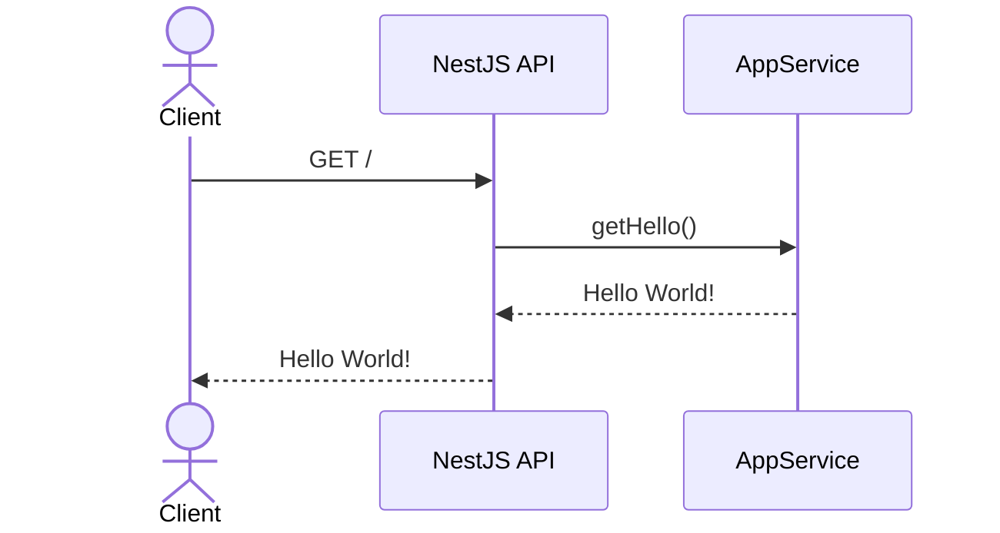
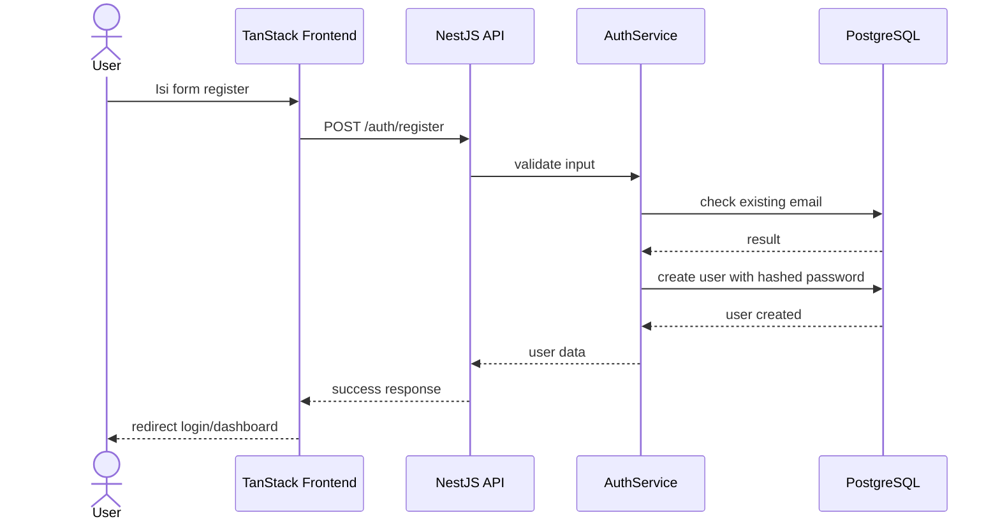
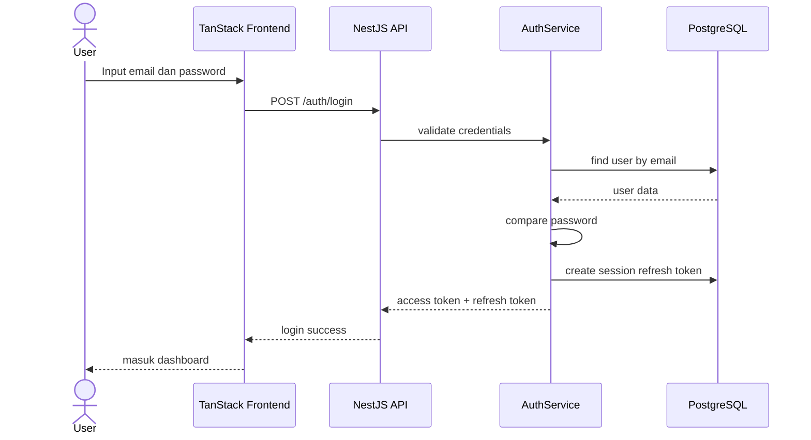
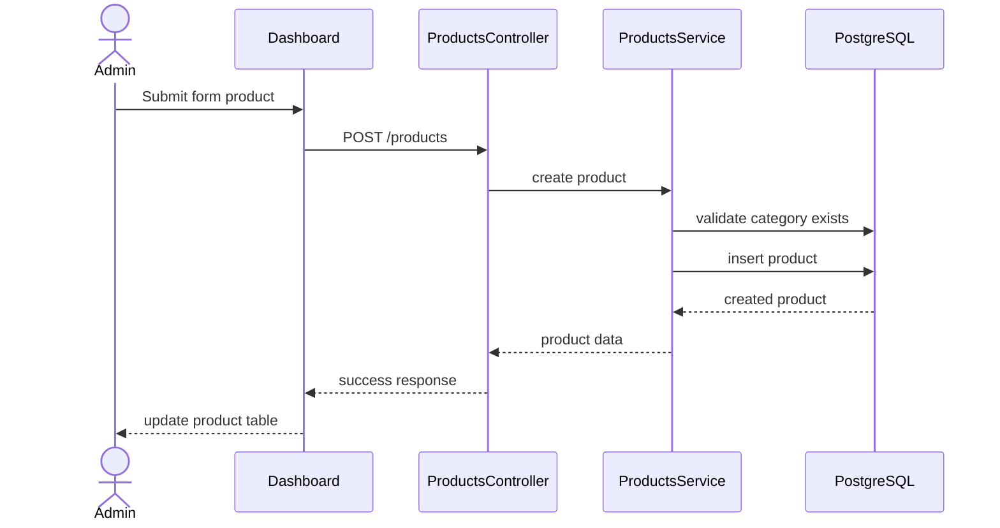

# Workflows

## Workflow Aktual

### GET Root Backend

User/Client mengakses backend `/`.
Backend mengembalikan `Hello World!`.

## Workflow Target (Perlu Dibuat)

### Register

### Login

### Product Management

