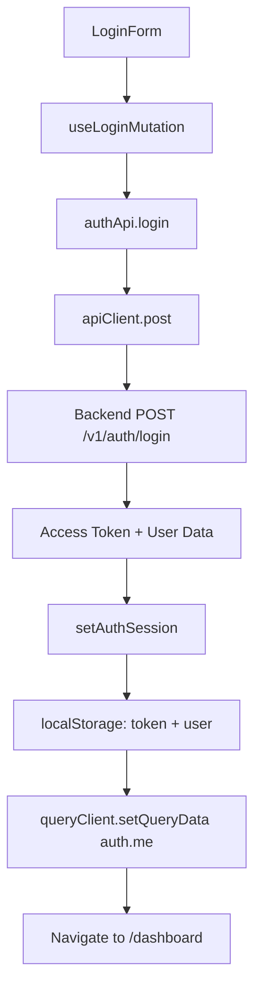

# Priceyless Web

Frontend dashboard web untuk aplikasi Priceyless — dibangun dengan React 19, TanStack Router, TanStack Query, dan Tailwind CSS v4.

## Table of Contents

- [Overview](#overview)
- [Tech Stack](#tech-stack)
- [Frontend Architecture](#frontend-architecture)
- [Folder Structure](#folder-structure)
- [Routing](#routing)
- [Authentication Flow](#authentication-flow)
- [State and Server Cache](#state-and-server-cache)
- [API Integration](#api-integration)
- [UI Component System](#ui-component-system)
- [Feature Modules](#feature-modules)
- [Environment Variables](#environment-variables)
- [Local Development](#local-development)
- [Build Process](#build-process)
- [Running with Docker](#running-with-docker)
- [Testing](#testing)
- [Common Commands](#common-commands)
- [Troubleshooting](#troubleshooting)
- [Current Limitations](#current-limitations)
- [Future Improvements](#future-improvements)

---

## Overview

Priceyless Web adalah dashboard web yang menyediakan antarmuka untuk:

- **Login dan Register** — autentikasi user.
- **Dashboard Overview** — ringkasan statistik: total produk, kategori, stok, dan nilai inventaris.
- **Manajemen Kategori** — CRUD kategori dengan tabel, pencarian, dan modal form.
- **Manajemen Produk** — CRUD produk dengan tabel, pencarian, filter kategori, dan modal form.
- **Halaman Profil** — menampilkan data user aktif.

Aplikasi ini menggunakan arsitektur feature-based dengan TanStack Router (file-based routing) dan TanStack Query untuk state management server-side.

---

## Tech Stack

| Technology | Version | Purpose |
|---|---|---|
| React | 19.2 | UI framework |
| TypeScript | 5.7 | Type safety |
| TanStack Start | 1.132 | Full-stack React framework (SSR-capable) |
| TanStack Router | 1.132 | File-based routing |
| TanStack Query | 5.66 | Server state management & caching |
| Tailwind CSS | 4.0 | Utility-first CSS framework |
| Vite | 7.1 | Build tool & dev server |
| Lucide React | 0.561 | Icon library |
| clsx | 2.1 | Conditional classname utility |
| tailwind-merge | 3.0 | Tailwind class merging |
| tw-animate-css | 1.3 | Tailwind animation utilities |
| Vitest | 3.0 | Unit testing |
| Testing Library | 16.2 | React component testing |
| pnpm | 10.24 | Package manager |
| Docker | - | Containerization |

---

## Frontend Architecture

### Pola Feature-Based

Aplikasi menggunakan arsitektur feature-based di mana setiap domain (auth, categories, products, dashboard) terorganisasi secara independen:

```
features/
├── auth/          — autentikasi (login, register, session)
├── categories/    — manajemen kategori
├── products/      — manajemen produk
└── dashboard/     — halaman overview
```

Setiap feature memiliki:
- `types.ts` — TypeScript interfaces untuk request/response
- `api.ts` — API client functions yang memanggil backend
- `hooks.ts` — TanStack Query hooks (queries + mutations)
- `components/` — UI components spesifik feature

### Layer

| Layer | Lokasi | Fungsi |
|---|---|---|
| **Routes** | `src/routes/` | Halaman dan route definitions (TanStack Router file-based) |
| **Features** | `src/features/` | Business logic per domain |
| **Components** | `src/components/` | Shared UI components (ui, common, layout) |
| **Lib** | `src/lib/` | Utilities: API client, auth storage, query keys, route guards |
| **Config** | `src/config/` | Application configuration |
| **Integrations** | `src/integrations/` | Third-party integrations (TanStack Query provider) |

---

## Folder Structure

```txt
web/
├── public/
│   ├── favicon.ico
│   ├── manifest.json              # PWA manifest
│   └── robots.txt
├── src/
│   ├── components/
│   │   ├── common/
│   │   │   ├── ConfirmDialog.tsx   # Reusable confirmation dialog
│   │   │   ├── EmptyState.tsx      # Empty data placeholder
│   │   │   ├── ErrorState.tsx      # Error state with retry
│   │   │   └── LoadingState.tsx    # Loading spinner & skeleton
│   │   ├── layout/
│   │   │   ├── AuthLayout.tsx      # Centered card layout for auth pages
│   │   │   └── DashboardLayout.tsx # Sidebar + topbar layout
│   │   └── ui/
│   │       ├── Button.tsx          # Button component with variants
│   │       ├── Card.tsx            # Card container
│   │       ├── Input.tsx           # Text input field
│   │       ├── Modal.tsx           # Modal dialog
│   │       ├── Select.tsx          # Select dropdown
│   │       ├── Table.tsx           # Table components (Table, TableRow, etc.)
│   │       ├── Textarea.tsx        # Textarea field
│   │       └── Toast.tsx           # Toast notification system
│   ├── config/
│   │   └── app.config.ts           # App name & API base URL config
│   ├── features/
│   │   ├── auth/
│   │   │   ├── api.ts              # Auth API calls (login, register, me)
│   │   │   ├── hooks.ts            # useMeQuery, useLoginMutation, etc.
│   │   │   ├── types.ts            # User, LoginRequest, LoginResponse types
│   │   │   └── components/
│   │   │       ├── LoginForm.tsx
│   │   │       └── RegisterForm.tsx
│   │   ├── categories/
│   │   │   ├── api.ts              # Categories API calls
│   │   │   ├── hooks.ts            # CRUD hooks with cache invalidation
│   │   │   ├── types.ts            # Category types
│   │   │   └── components/
│   │   │       └── CategoryForm.tsx
│   │   ├── products/
│   │   │   ├── api.ts              # Products API calls
│   │   │   ├── hooks.ts            # CRUD hooks with cache invalidation
│   │   │   ├── types.ts            # Product types
│   │   │   └── components/
│   │   │       └── ProductForm.tsx
│   │   └── dashboard/
│   │       └── components/
│   │           ├── DashboardOverview.tsx  # Stats cards & recent products
│   │           └── StatsCard.tsx          # Individual stat card
│   ├── integrations/
│   │   └── tanstack-query/
│   │       ├── devtools.tsx        # TanStack Query devtools
│   │       └── root-provider.tsx   # QueryClient provider setup
│   ├── lib/
│   │   ├── api-client.ts           # HTTP client (fetch wrapper with auth)
│   │   ├── auth-storage.ts         # localStorage helpers for token & user
│   │   ├── query-keys.ts           # Centralized TanStack Query keys
│   │   ├── route-guard.tsx         # RequireAuth, RequireAdmin, RedirectIfAuthenticated
│   │   └── utils.ts                # Utility functions (cn, etc.)
│   ├── routes/
│   │   ├── __root.tsx              # Root layout with HTML shell, Toast, DevTools
│   │   ├── index.tsx               # / → redirect to /dashboard or /login
│   │   ├── login.tsx               # /login page
│   │   ├── register.tsx            # /register page
│   │   └── dashboard/
│   │       ├── index.tsx           # /dashboard — overview page
│   │       ├── categories.tsx      # /dashboard/categories — category CRUD
│   │       ├── products.tsx        # /dashboard/products — product CRUD
│   │       └── profile.tsx         # /dashboard/profile — user profile
│   ├── routeTree.gen.ts            # Auto-generated route tree (jangan edit manual)
│   ├── router.tsx                  # Router instance setup
│   └── styles.css                  # Global Tailwind CSS imports
├── Dockerfile                      # Multi-stage Docker build
├── package.json
├── tsconfig.json
└── vite.config.ts                  # Vite + TanStack Start + Tailwind plugins
```

### Penjelasan Folder Penting

| Folder | Fungsi |
|---|---|
| `src/components/ui/` | Base UI components (Button, Input, Modal, Table, Toast, dll). Dipakai oleh semua feature. |
| `src/components/common/` | Shared components: ConfirmDialog, EmptyState, ErrorState, LoadingState |
| `src/components/layout/` | Layout wrappers: AuthLayout (untuk login/register), DashboardLayout (sidebar + topbar) |
| `src/features/` | Setiap feature terorganisasi sendiri dengan api, hooks, types, dan components |
| `src/lib/` | Core utilities: API client, auth storage, route guards, query keys |
| `src/routes/` | File-based route definitions untuk TanStack Router |

---

## Routing

### Route Definitions

| Path | Component | Auth | Description |
|---|---|---|---|
| `/` | `Index` | - | Redirect ke `/dashboard` (jika login) atau `/login` (jika belum) |
| `/login` | `LoginPage` | `RedirectIfAuthenticated` | Form login |
| `/register` | `RegisterPage` | `RedirectIfAuthenticated` | Form register |
| `/dashboard/` | `DashboardIndexPage` | `RequireAuth` | Overview dengan stats cards |
| `/dashboard/categories` | `CategoriesPage` | `RequireAuth` | Tabel CRUD kategori |
| `/dashboard/products` | `ProductsPage` | `RequireAuth` | Tabel CRUD produk |
| `/dashboard/profile` | `ProfilePage` | `RequireAuth` | Profil user |

### File-Based Routing

TanStack Router menggunakan file-based routing. Setiap file di `src/routes/` secara otomatis menjadi route. File `routeTree.gen.ts` di-generate otomatis oleh TanStack Router plugin — **jangan edit manual** kecuali kamu paham cara kerja TanStack Router code generation.

### Route Guards

| Guard | Fungsi |
|---|---|
| `RequireAuth` | Redirect ke `/login` jika tidak ada access token |
| `RequireAdmin` | Redirect ke `/login` jika tidak ada token, atau ke `/dashboard` jika role bukan `ADMIN` |
| `RedirectIfAuthenticated` | Redirect ke `/dashboard` jika sudah login |

---

## Authentication Flow

### Flow Login



### Flow Register

1. User mengisi form register (`RegisterForm`).
2. `useRegisterMutation` memanggil `authApi.register`.
3. API mengirim `POST /v1/auth/register`.
4. Setelah berhasil, user diarahkan ke `/login`.

### Auth Storage

Token dan data user disimpan di `localStorage`:

| Key | Value |
|---|---|
| `priceyless_access_token` | JWT access token |
| `priceyless_user` | JSON string dari user object |

### Auto-Logout

`apiClient` secara otomatis membersihkan session (menghapus token dari localStorage) saat menerima response `401 Unauthorized`.

---

## State and Server Cache

### TanStack Query

Semua server state dikelola oleh TanStack Query:

| Hook | Query Key | Fungsi |
|---|---|---|
| `useMeQuery` | `['auth', 'me']` | Ambil data user aktif dari `/v1/auth/me` |
| `useCategoriesQuery` | `['categories']` | List semua kategori |
| `useCategoryQuery(id)` | `['categories', id]` | Detail satu kategori |
| `useProductsQuery` | `['products']` | List semua produk |
| `useProductQuery(id)` | `['products', id]` | Detail satu produk |

### Mutations & Cache Invalidation

Setiap mutation (create/update/delete) secara otomatis meng-invalidate query terkait:

| Mutation | Invalidated Queries |
|---|---|
| `useCreateCategoryMutation` | `['categories']` |
| `useUpdateCategoryMutation` | `['categories']`, `['categories', id]` |
| `useDeleteCategoryMutation` | `['categories']` |
| `useCreateProductMutation` | `['products']` |
| `useUpdateProductMutation` | `['products']`, `['products', id]` |
| `useDeleteProductMutation` | `['products']` |

### Query Keys

Query keys didefinisikan terpusat di `src/lib/query-keys.ts` untuk memastikan konsistensi:

```typescript
export const queryKeys = {
  auth: { me: ['auth', 'me'] },
  products: { all: ['products'], detail: (id) => ['products', id] },
  categories: { all: ['categories'], detail: (id) => ['categories', id] },
};
```

---

## API Integration

### API Client

`src/lib/api-client.ts` adalah wrapper di atas `fetch` yang:

1. Mengambil base URL dari `appConfig.apiBaseUrl`.
2. Menambahkan header `Authorization: Bearer <token>` jika token tersedia.
3. Mengirim request dengan `Content-Type: application/json`.
4. Mengunwrap response envelope `{ status, message, data }` — hanya mengembalikan `data`.
5. Melempar `ApiClientError` pada error dengan status code, code, dan details.
6. Secara otomatis memanggil `clearAuthSession()` saat menerima `401`.

```typescript
// Contoh penggunaan
const products = await apiClient.get<Product[]>('/v1/products');
const newProduct = await apiClient.post<Product>('/v1/products', payload);
```

### Feature API Modules

Setiap feature memiliki module API:

**`features/auth/api.ts`:**
- `authApi.register(payload)` → `POST /v1/auth/register`
- `authApi.login(payload)` → `POST /v1/auth/login`
- `authApi.me()` → `GET /v1/auth/me`

**`features/categories/api.ts`:**
- `categoriesApi.findAll()` → `GET /v1/categories`
- `categoriesApi.findOne(id)` → `GET /v1/categories/:id`
- `categoriesApi.create(payload)` → `POST /v1/categories`
- `categoriesApi.update(id, payload)` → `PATCH /v1/categories/:id`
- `categoriesApi.remove(id)` → `DELETE /v1/categories/:id`

**`features/products/api.ts`:**
- `productsApi.findAll()` → `GET /v1/products`
- `productsApi.findOne(id)` → `GET /v1/products/:id`
- `productsApi.create(payload)` → `POST /v1/products`
- `productsApi.update(id, payload)` → `PATCH /v1/products/:id`
- `productsApi.remove(id)` → `DELETE /v1/products/:id`

---

## UI Component System

### Base UI Components (`components/ui/`)

| Component | Fungsi |
|---|---|
| `Button` | Tombol dengan variants: default, outline, danger, ghost. Supports `size`, `disabled`, `loading` props. |
| `Input` | Text input field dengan label, error state, dan placeholder support. |
| `Textarea` | Multiline text input. |
| `Select` | Dropdown select component. |
| `Card` | Container card dengan header dan content sections. |
| `Modal` | Modal dialog overlay dengan title, close button, dan content area. |
| `Table` | Table components: `Table`, `TableHeader`, `TableBody`, `TableRow`, `TableHead`, `TableCell`. |
| `Toast` | Toast notification system dengan `ToastProvider` context dan `useToast()` hook. |

### Common Components (`components/common/`)

| Component | Fungsi |
|---|---|
| `ConfirmDialog` | Konfirmasi aksi berbahaya (delete) dengan cancel/confirm buttons. |
| `EmptyState` | Tampilan placeholder ketika tidak ada data. |
| `ErrorState` | Tampilan error dengan message dan tombol retry. |
| `LoadingState` | Loading spinner. |
| `LoadingSkeleton` | Loading placeholder dengan bentuk skeleton. |

### Layout Components (`components/layout/`)

| Component | Fungsi |
|---|---|
| `AuthLayout` | Layout terpusat (centered card) untuk halaman login dan register. |
| `DashboardLayout` | Layout dengan sidebar navigasi dan topbar untuk halaman dashboard. |

### Design System

Aplikasi menggunakan custom design system dengan warna:

| Token | Hex | Penggunaan |
|---|---|---|
| Primary/Accent | `#ff385c` | Tombol utama, link, brand color |
| Text | `#222222` | Teks utama |
| Muted | `#6a6a6a` | Teks sekunder, deskripsi |
| Border | `#dddddd` | Border, divider |
| Background | `#f7f7f7` | Background halaman, input bg |
| Danger | `#c13515` | Tombol delete, error indicator |

---

## Feature Modules

### Auth

**Components:**
- `LoginForm` — form email + password dengan `useLoginMutation`.
- `RegisterForm` — form name + email + password dengan `useRegisterMutation`.

**Hooks:**
- `useMeQuery()` — fetch data user aktif (enabled hanya jika token ada).
- `useLoginMutation()` — login dan simpan session.
- `useRegisterMutation()` — register user baru.
- `useLogout()` — clear session dan query cache.

**Types:**
- `User` — `{ id, name, email, role, createdAt?, updatedAt? }`
- `LoginRequest` — `{ email, password }`
- `RegisterRequest` — `{ name, email, password }`
- `LoginResponse` — `{ accessToken, user }`
- `Role` — `'USER' | 'ADMIN'`

### Categories

**Components:**
- `CategoryForm` — form untuk create/edit kategori (name + description).

**Hooks:**
- `useCategoriesQuery()` — list semua kategori.
- `useCategoryQuery(id)` — detail satu kategori.
- `useCreateCategoryMutation()` — buat kategori baru.
- `useUpdateCategoryMutation()` — update kategori.
- `useDeleteCategoryMutation()` — hapus kategori.

**Route (`/dashboard/categories`):**
- Tabel kategori dengan kolom: Name, Description, Products (count), Actions.
- Pencarian by name.
- Modal form untuk create/edit.
- ConfirmDialog untuk delete.
- Tombol aksi (Add, Edit, Delete) hanya ditampilkan untuk role `ADMIN`.

### Products

**Components:**
- `ProductForm` — form untuk create/edit produk (name, description, price, stock, categoryId).

**Hooks:**
- `useProductsQuery()` — list semua produk.
- `useProductQuery(id)` — detail satu produk.
- `useCreateProductMutation()` — buat produk baru.
- `useUpdateProductMutation()` — update produk.
- `useDeleteProductMutation()` — hapus produk.

**Route (`/dashboard/products`):**
- Tabel produk dengan kolom: Name, Category, Price, Stock, Actions.
- Pencarian by name dan filter by kategori.
- Modal form untuk create/edit.
- ConfirmDialog untuk delete.
- Stok <= 5 ditampilkan dengan warna merah.
- Tombol aksi hanya ditampilkan untuk role `ADMIN`.

### Dashboard

**Components:**
- `DashboardOverview` — halaman overview dengan 4 stats cards dan tabel 5 produk terbaru.
- `StatsCard` — card statistik individual dengan icon, title, dan value.

**Stats yang ditampilkan:**
- Total Products
- Total Categories
- Total Stock
- Inventory Value (harga × stok semua produk)

---

## Environment Variables

| Variable | Required | Default | Example | Description |
|---|---|---|---|---|
| `VITE_API_BASE_URL` | No | `http://localhost:3000` | `/api` | Base URL untuk API requests |

### Penggunaan

- **Docker/Nginx:** Set `VITE_API_BASE_URL=/api` — semua request akan melalui Nginx proxy.
- **Local Development (tanpa Nginx):** Set `VITE_API_BASE_URL=http://localhost:3000` — request langsung ke API.

Konfigurasi diakses via `appConfig.apiBaseUrl` di `src/config/app.config.ts`.

---

## Local Development

### Prasyarat

- Node.js 22+
- pnpm 10.24+
- Backend API berjalan (lokal atau via Docker)

### Langkah

```bash
# 1. Install dependencies
cd web
pnpm install

# 2. Setup environment
cp .env.example .env
# Edit .env jika perlu

# 3. Jalankan development server
pnpm dev
```

Web akan berjalan di `http://localhost:3000`.

### Konfigurasi API

**Jika API berjalan langsung (tanpa Docker/Nginx):**

```env
VITE_API_BASE_URL=http://localhost:3000
```

**Jika API berjalan via Docker/Nginx:**

```env
VITE_API_BASE_URL=/api
```

---

## Build Process

### Development

```bash
pnpm dev
```

Menjalankan Vite dev server dengan HMR (Hot Module Replacement) di port 3000.

### Production Build

```bash
pnpm build
```

Menggunakan `vite build` untuk menghasilkan output static di folder `dist/`.

### Preview

```bash
pnpm preview
```

Menjalankan production preview server dari folder `dist/`.

---

## Running with Docker

### Multi-Stage Dockerfile

```dockerfile
# Stage 1: base — Node.js 22 Alpine + pnpm 10.24.0
# Stage 2: deps — install dependencies
# Stage 3: builder — vite build (dengan build arg VITE_API_BASE_URL)
# Stage 4: runner — copy dist + node_modules, jalankan preview server
```

**Build args:**
- `VITE_API_BASE_URL` — base URL untuk API (default: `/api`).

**Runtime command:**
```bash
pnpm run preview --port 3000 --host 0.0.0.0
```

### Dari Root Project

```bash
docker compose up --build
```

Web container akan berjalan di port `${WEB_PORT:-3002}` (host) → `3000` (container).

---

## Testing

### Setup

Testing dependencies sudah terinstall:
- `vitest` — test runner
- `@testing-library/react` — React component testing
- `@testing-library/dom` — DOM testing utilities
- `jsdom` — browser environment simulation

### Menjalankan Tests

```bash
pnpm test
```

Menjalankan semua test files dengan Vitest.

**Note:** Pastikan script `test` di `package.json` sudah dikonfigurasi dengan benar. Saat ini script `test` menggunakan `vitest run`.

---

## Common Commands

| Command | Description |
|---|---|
| `pnpm install` | Install dependencies |
| `pnpm dev` | Jalankan dev server dengan HMR |
| `pnpm build` | Build production ke folder `dist/` |
| `pnpm preview` | Preview production build |
| `pnpm test` | Jalankan unit tests dengan Vitest |

---

## Troubleshooting

### `.output not found` during Docker build

**Cause:** Vite build menghasilkan output di `dist/`, bukan `.output/` (yang digunakan oleh framework lain seperti Nitro/Nuxt).

**Fix:** Pastikan Dockerfile menggunakan:
```dockerfile
COPY --from=builder /app/dist ./dist
```

Bukan `.output`.

### pnpm ignored builds

**Cause:** pnpm memblokir build script dari some dependencies.

**Fix:** Sudah ditangani di `package.json`:
```json
"pnpm": {
  "onlyBuiltDependencies": [
    "@parcel/watcher",
    "esbuild",
    "sharp"
  ]
}
```

### API request gagal

**Cause:** Frontend tidak dapat mengakses backend API.

**Checklist:**
1. Pastikan `VITE_API_BASE_URL` benar.
2. Jika menggunakan `/api`, pastikan Nginx berjalan dan proxy ke API.
3. Jika menggunakan `http://localhost:3000`, pastikan API berjalan.
4. Cek token di localStorage — jika 401, token akan di-clear otomatis.
5. Cek CORS config di backend (`CORS_ORIGIN` env variable).

### Route guard redirect terus-menerus

**Cause:** Token tidak tersimpan atau auth storage bermasalah.

**Fix:**
1. Buka browser DevTools → Application → Local Storage.
2. Pastikan `priceyless_access_token` dan `priceyless_user` ada.
3. Jika token ada tapi redirect terus, kemungkinan token expired — clear storage dan login ulang.
4. Pastikan backend endpoint `/v1/auth/me` berfungsi dengan token tersebut.

### Vite dev server port conflict

**Cause:** Port 3000 sudah digunakan.

**Fix:** Jalankan dengan port lain:
```bash
pnpm dev --port 3001
```

---

## Current Limitations

1. **Belum ada pagination UI** — Semua data di-load sekaligus tanpa pagination. Ini dapat menjadi masalah saat data sangat banyak.

2. **Belum ada upload gambar produk** — Produk hanya memiliki data text (name, description, price, stock). Belum ada fitur upload gambar.

3. **Belum ada advanced search/filter** — Pencarian hanya berbasis name (contains). Belum ada filter by price range, stock range, atau sorting.

4. **Belum ada edit profile** — Halaman profil (`/dashboard/profile`) hanya menampilkan data user. Belum ada form untuk update nama, email, atau password.

5. **Form validation masih manual** — Menggunakan HTML `required` attribute. Belum ada form validation library seperti React Hook Form dengan Zod resolver.

6. **Error handling masih sederhana** — Error ditampilkan via toast notification. Belum ada detailed field-level error display pada form.

7. **Tidak ada responsive sidebar** — DashboardLayout sidebar mungkin belum optimal untuk mobile screen.

8. **Belum ada role-specific UI** — Tidak ada perbedaan UI yang signifikan antara role USER dan ADMIN selain visibility tombol aksi.

---

## Future Improvements

- [ ] Form validation yang lebih kuat (React Hook Form + Zod)
- [ ] Server-side pagination
- [ ] Product image upload
- [ ] Advanced search dan filtering
- [ ] Edit profile (nama, email, password)
- [ ] Role-specific dashboard (admin vs user view)
- [ ] Better empty/error state illustrations
- [ ] UI theming (dark mode)
- [ ] E2E testing dengan Playwright atau Cypress
- [ ] CI/CD build check
- [ ] Responsive sidebar untuk mobile
- [ ] Breadcrumb navigation
- [ ] Keyboard shortcuts
- [ ] Export data (CSV/PDF)
